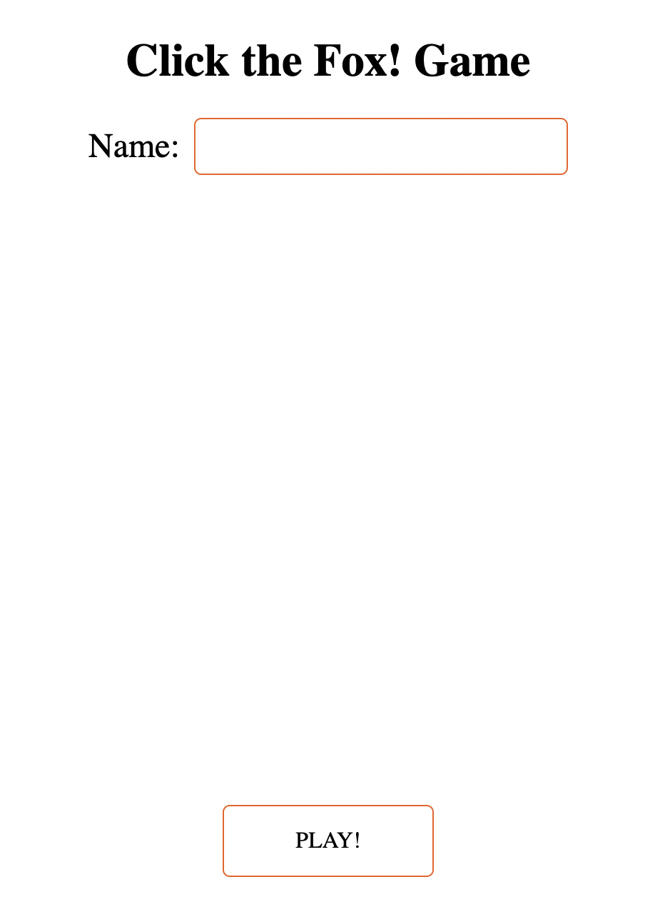
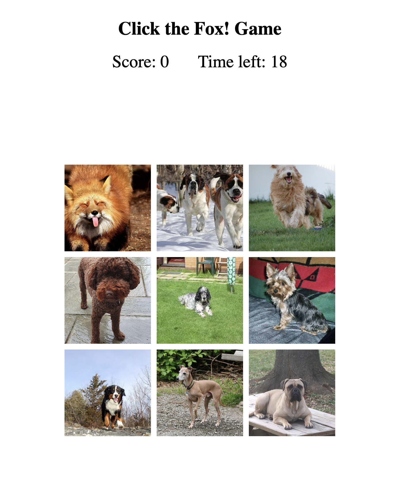
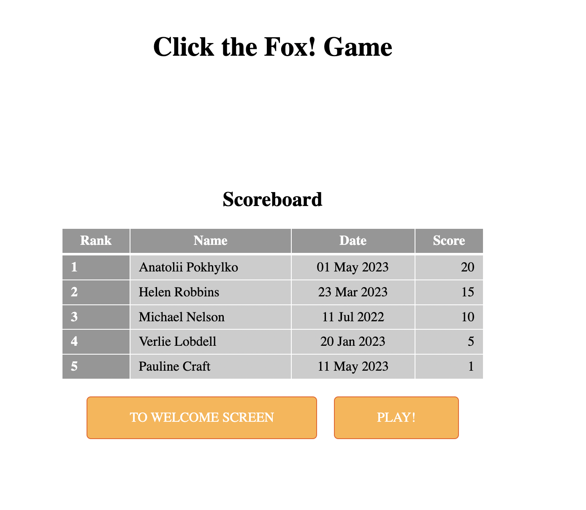

<div align="center">
  <a href="https://github.com/pokhylko/click-the-fox">
    
  </a>

<h3 align="center">Click the fox!</h3>

  <p align="center">
    A little game in the browser. Click the fox as many times as you can within 30 seconds.
    <br />
    <br />
    <a href="https://pokhylko.github.io/click-the-fox">View Demo</a>
    ·
    <a href="https://github.com/pokhylko/click-the-fox/issues">Report Bug</a>
    ·
    <a href="https://github.com/pokhylko/click-the-fox/issues">Request Feature</a>
  </p>
</div>

<!-- TABLE OF CONTENTS -->
<details>
  <summary>Table of Contents</summary>
  <ol>
    <li>
      <a href="#about-the-project">About The Project</a>
      <ul>
        <li><a href="#built-with">Built With</a></li>
      </ul>
    </li>
    <li>
      <a href="#getting-started">Getting Started</a>
      <ul>
        <li><a href="#prerequisites">Prerequisites</a></li>
        <li><a href="#installation">Installation</a></li>
      </ul>
    </li>
    <li><a href="#usage">Usage</a></li>
    <li><a href="#roadmap">Roadmap</a></li>
    <li><a href="#contributing">Contributing</a></li>
    <li><a href="#license">License</a></li>
    <li><a href="#contact">Contact</a></li>
    <li><a href="#acknowledgments">Acknowledgments</a></li>
  </ol>
</details>


<!-- ABOUT THE PROJECT -->
## About The Project

![Click the fox Screen Shot][images/screenshot.png]


### Built With

* React.js
* Typescript
* SASS
* React Router
* ESLint
* Prettier

<!-- GETTING STARTED -->
## Getting Started

This is an example of how you may give instructions on setting up your project locally.
To get a local copy up and running follow these simple example steps.

### Installation

1. Get a free API Key at [https://example.com](https://example.com)
2. Clone the repo
   ```sh
   git clone https://github.com/pokhylko/click-the-fox.git
   ```
3. Install NPM packages
   ```sh
   yarn install
   ```

<!-- USAGE EXAMPLES -->
## Usage

1. Enter your name and start the game



2. Find the fox and click on it. Do not forget there are a lot of dogs around



3. Look for your result in the table. I am sure it is up there somewhere.



4. Try to improve it. Good luck!

<!-- ISSUES -->
## Issues

See the [open issues](https://github.com/pokhylko/click-the-fox/issues) for a full list of proposed features (and known issues).

<!-- CONTRIBUTING -->
## Contributing

Contributions are what make the open source community such an amazing place to learn, inspire, and create. Any contributions you make are **greatly appreciated**.

If you have a suggestion that would make this better, please fork the repo and create a pull request. You can also simply open an issue with the tag "enhancement".
Don't forget to give the project a star! Thanks again!

1. Fork the Project
2. Create your Feature Branch (`git checkout -b feature/featureName`)
3. Commit your Changes (`git commit -m 'feat: add some feature'`)
4. Push to the Branch (`git push origin feature/featureName`)
5. Open a Pull Request

<!-- CONTACT -->
## Contact

Anatolii Pokhylko - pokhylko@gmail.com

Project Link: [https://pokhylko.github.io/click-the-fox](https://pokhylko.github.io/click-the-fox)

<!-- MARKDOWN LINKS & IMAGES -->
[product-screenshot]: images/screenshot.png

